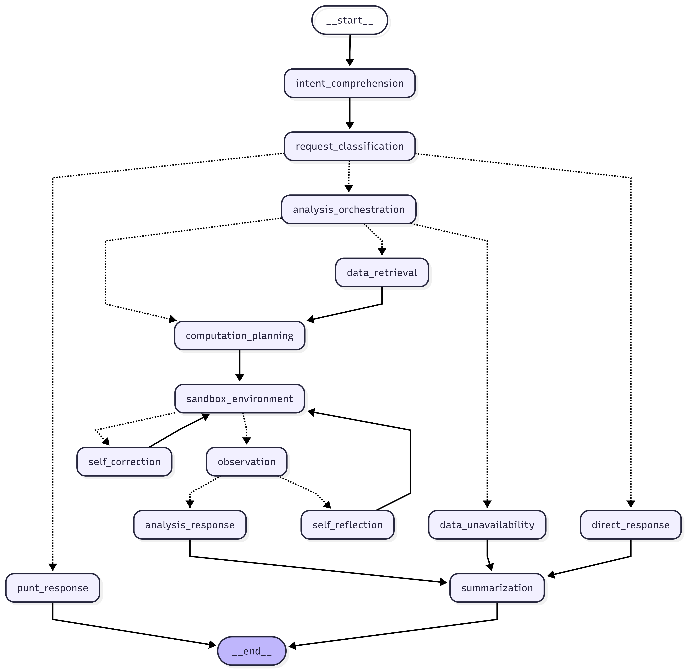

<div id="top">

<div align="center">

# CONVERSATIONAL BUSINESS ANALYTICS

<em>Agentic AI for Interactive Business Analytics & Reasoning</em>

<em>Built with:</em>


<br>


</div>

## Table of Contents

- [Overview](#overview)
- [Graph Diagram](#graph-diagram)
- [Design Philosophy](#design-philosophy)
- [Architecture](#architecture)
- [Features](#features)
- [Project Status](#project-status)
- [Getting Started](#getting-started)
  - [Prerequisites](#prerequisites)
  - [Environment Setup](#environment-setup)
  - [Installation](#installation)
  - [Running the System](#running-the-system)
- [Synthetic Data & External Database](#synthetic-data--external-database)
- [Interactive Graph Feature](#interactive-graph-feature)
- [Notes for Contributors](#notes-for-contributors)

## Overview

**Conversational Business Analytics (CBA – Agentic)** is an experimental, open-source system for building **agentic, LLM-driven business analytics workflows**.

The system allows users to:

- ask natural-language business questions,
- have an LLM reason about intent and analytical strategy,
- execute data analysis through a controlled runtime,
- and present results interactively via a Streamlit UI.

This project is designed as a **learning, research, and prototyping platform**, not a finished BI product.

## Graph Diagram

<div align="center">
  
</div>

- ### `intent_comprehension`

  Analyzes the user’s message to understand what the user is trying to achieve at a semantic level. Produces a structured representation of intent that guides downstream routing and reasoning.

- ### `request_classification`

  Classifies the request into one of several high-level execution paths:

  - analytical workflow,
  - direct conversational response,
  - or out-of-domain request.

  This node determines whether the system should think, compute, or simply respond.

- ### `analysis_orchestration`

  Determines the analytical strategy required to answer the request. Decides whether:

  - existing data is sufficient,
  - external data must be retrieved,
  - or analytical computation can begin immediately.

  This node acts as the control tower for analytical execution.

- ### `data_retrieval`

  Executes data extraction from an external database when required. Runs structured queries, persists the retrieved data into the working dataset, and prepares it for computation.

- ### `data_unavailability`

  Handles cases where required business data does not exist or is insufficient. Generates an explanatory response to the user instead of forcing incomplete or misleading analysis.

- ### `computation_planning`

  Generates a step-by-step analytical computation plan in executable Python. Each step is explicitly defined to ensure traceability, debuggability, and iterative refinement.

- ### `sandbox_environment`

  Executes the planned computation in an isolated sandbox environment. Loads the working dataset, runs the generated code safely, and captures execution results or errors.

- ### `observation`

  Evaluates the outcome of the sandbox execution. Determines whether the result is:

  - sufficient to answer the question, or
  - incomplete and requiring refinement.

  This is where the system checks its own work.

- ### `self_correction`

  Triggered when execution fails due to errors (e.g., syntax or runtime issues). Regenerates a corrected computation plan and retries execution without user intervention.

- ### `self_reflection`

  Triggered when execution succeeds but the result is analytically insufficient. Refines the analytical plan to improve result quality, depth, or correctness.

- ### `analysis_response`

  Formulates a final, user-facing response based on validated analytical results. Integrates computation output, contextual data, and natural language explanation.

- ### `direct_response`

  Generates an immediate response without analytical computation. Used for conversational, explanatory, or low-complexity requests.

- ### `punt_response`

  Handles requests that fall outside the supported analytical or business domain. Politely declines while maintaining conversational continuity.

- ### `summarization`

  Persists conversational memory and analytical context. Stores chat history, summaries, and relevant metadata to support future turns and continuity.

## Design Philosophy

This project follows a few non-negotiable principles:

- **Explicit contracts over implicit behavior**: LLM outputs are constrained using Pydantic schemas.
- **Graph-based reasoning**: Analytical workflows are modeled explicitly using LangGraph.
- **Reproducible environments**: Docker is the default execution path.
- **Synthetic data first**: External business data is generated for development and testing.
- **Separation of concerns**: UI, orchestration, schemas, runtime, and persistence are isolated.

## Architecture

High-level structure:

```sh
.
├── application/ # Streamlit UI & user interaction
├── cache/ # Cold start & caching utilities
├── context/ # Internal datasets & contextual memory
├── docker_scripts/ # External DB seeding & synthetic data factory
├── graph/ # LangGraph nodes, runtime, orchestration
├── schema/ # Pydantic schemas for LLM structured outputs
├── schema/ # Custom Streamlit decorator
└── main.py # Application entrypoint
```

Key ideas:

- **`schema/`** defines strict contracts for LLM outputs.
- **`graph/`** encodes reasoning and execution as a stateful graph.
- **`docker_scripts/`** exists solely to provision external business data.

## Features

- 🧠 **Agentic Reasoning Pipeline**

  Intent → classification → planning → execution → observation.

- 📊 **Business Analytics Focus**  

  Designed for descriptive and diagnostic analysis (with room to grow).

- 🧾 **Structured LLM Outputs**

  Enforced via Pydantic schemas.

- 🧩 **LangGraph-based Orchestration**

  Explicit state transitions and execution control.

- 🌐 **Interactive Streamlit UI**
- 🐳 **Fully Containerized Execution**
- 🗃️ **External PostgreSQL Integration**
- 🧪 **Synthetic Data Seeding for Development**

## Project Status

⚠️ **Work in Progress**

Current focus:

- Core reasoning pipeline stability
- Schema design and validation
- Runtime observability
- Developer ergonomics

Not production-ready. APIs, structure, and assumptions may change.

## Getting Started

### Prerequisites

You will need:

- **Docker**
- **Docker Compose**
- **Git**

No local Python installation is required if using Docker.

### Environment Setup

This project uses environment variables for configuration.

1. Copy the example file:

    ```sh
    cp .env.example .env
    ```

2. Fill in required values:

- API keys (Groq, E2B, optional LangSmith)
- PostgreSQL credentials (defaults work for Docker)

### Installation

Clone the repository:

```sh
git clone https://github.com/reyharighy/cba-agentic-ai.git
cd cba-agentic-ai
```

---

### Running the System

Using docker:

```sh
docker compose up -d --build
```

Then open:

```sh
http://localhost:8501
```

## Synthetic Data & External Database

This project depends on an external PostgreSQL database to simulate business data.

- Synthetic data is stored in docker_scripts/synthetic_data.csv
- The script external_database_factory.py:
  - creates the schema,
  - populates the database,
  - runs automatically on container startup if enabled.

Controlled via environment variable:

```env
ENABLE_EXTERNAL_DB_SEEDING=true
```

This allows:

- zero-setup onboarding for new users,
- reproducible analytical scenarios,
- safe experimentation without real business data.

## Interactive Graph Feature

This project supports an optional interactive execution graph that visualizes the agent’s reasoning flow and execution states.

When enabled, the system renders a step-by-step graph showing which node is currently active during execution. This is useful for debugging, inspection, and understanding how requests propagate through the pipeline.

The feature is enabled by default.

To disable it, set the following variable in your .env file:

```env
ENABLE_INTERACTIVE_GRAPH=false
```

When disabled, the system runs normally without any visualization overhead.

## Notes for Contributors

- This project prioritizes clarity over cleverness
- Explicit state > implicit magic
- If something is ambiguous, it should probably be a schema
- If something is implicit, it should probably be a graph edge

<div align="left"><a href="#top">⬆ Return</a></div>
